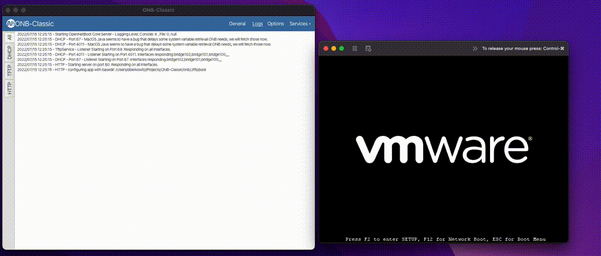

<p align="right">
<a href="https://autorelease.general.dmz.palantir.tech/palantir/onb-classic"></a>
</p>

# ONB-Classic


ONB-Classic is a program that combines ProxyDHCP Services, TFTP, and HTTP serving into one application.
This program allows for easy and quick spinning up for local network PXE booting environments without configuring
independent services. Each of these services can be enabled or disabled as the user wishes. Written in Java,
the application can be started with a JavaFX GUI or via the CLI. The program has been tested to work on dozens of models
of computers, and can run off of Windows, Linux, or Mac without modification. With the need to acquire service
ports 67 (DHCP), 69 (TFTP), 80 (HTTP - Configurable), and 4011 (ProxyDHCP) the application must
run as Administrator/Root unless just HTTP services are in use and moved to a higher port.

Docs: [Docs](https://palantir.github.io/onb-classic/), source in docs/source

Releases: [Releases on Github](https://github.com/palantir/onb-classic/releases)

**Platform Support**: Release JARs include JavaFX native libraries for Windows (x86-64), Linux (x86-64), and macOS (ARM64/Apple Silicon). Intel Macs and ARM Linux are not supported in releases; users on those platforms can [build from source for their architecture](https://palantir.github.io/onb-classic/development/index.html#building-for-different-platforms).



## Running

[Check out the getting started guide!](https://palantir.github.io/onb-classic/full-config/index.html)

## Building

```bash
./gradlew clean build shadowJar
```

The build will finish and put resources in "./build/libs/", onb-classic.jar has no dependencies included,
while onb-classic-all.jar has all its dependencies bundled into the jar.

## Licenses

This project is under Apache 2.0, some of the core TFTP files come from an old version of Apache Net Commons.

    Licensed to the Apache Software Foundation (ASF) under one or more
    contributor license agreements.  See the NOTICE file distributed with
    this work for additional information regarding copyright ownership.
    The ASF licenses this file to You under the Apache License, Version 2.0
    (the "License"); you may not use this file except in compliance with
    the License.  You may obtain a copy of the License at

          http://www.apache.org/licenses/LICENSE-2.0

    Unless required by applicable law or agreed to in writing, software
    distributed under the License is distributed on an "AS IS" BASIS,
    WITHOUT WARRANTIES OR CONDITIONS OF ANY KIND, either express or implied.
    See the License for the specific language governing permissions and
    limitations under the License.
